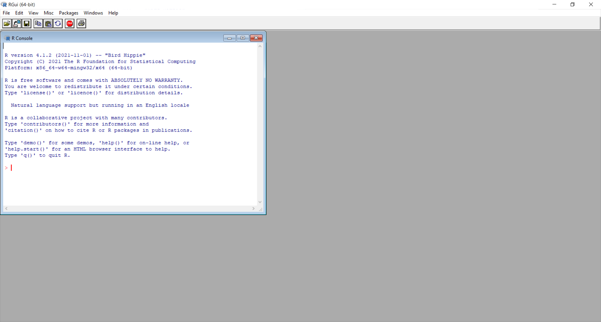
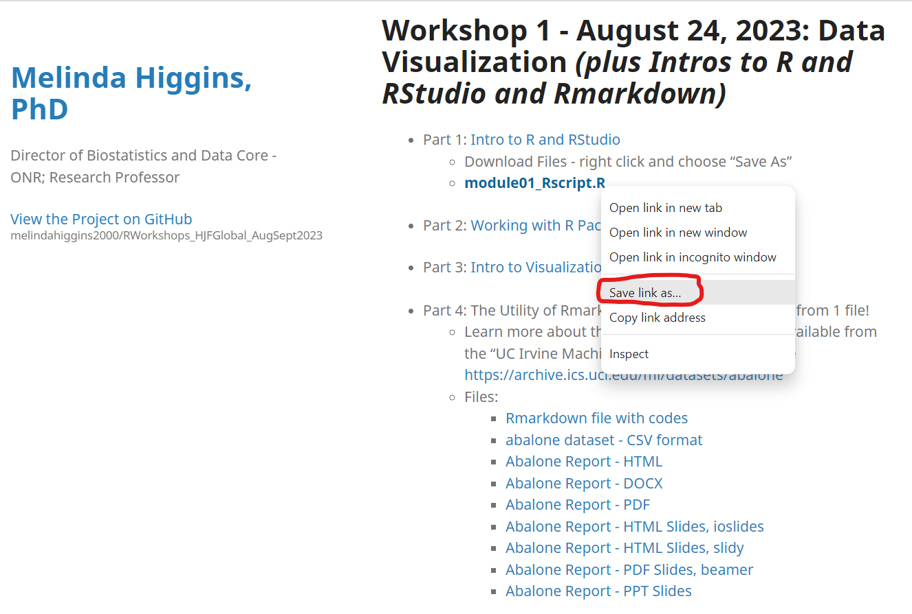
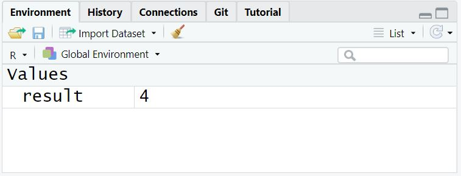
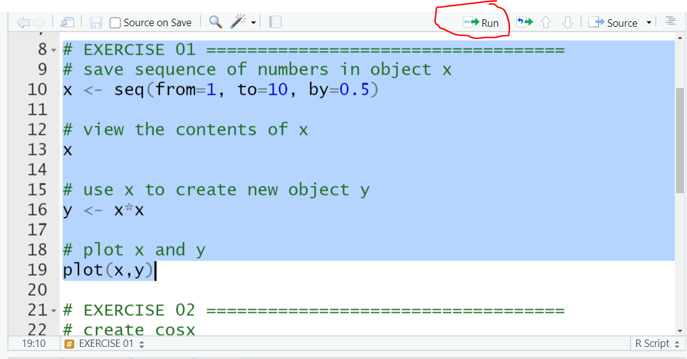

```{r setup, include=FALSE}
# For htmltools package, you may set options(htmltools.dir.version = FALSE) to suppress the version number in the subdirectory name.
options(htmltools.dir.version = FALSE)
knitr::opts_chunk$set(echo = TRUE)
knitr::opts_chunk$set(message = FALSE)
knitr::opts_chunk$set(warning = FALSE)
options(knitr.duplicate.label = "allow")

knitr::opts_chunk$set(fig.width = 6, message = FALSE, warning = FALSE, comment = "", cache = F)

library(emo)
library(fontawesome)
library(knitr)
library(dplyr)
library(flair)
library(flipbookr)
library(tidyverse)

library(xaringanExtra)
xaringanExtra::use_panelset()
xaringanExtra::use_tile_view()
```

# Overview - Website for All 4 Workshops

```{r out.width ='100%', echo=FALSE}
knitr::include_url("https://melindahiggins2000.github.io/RWorkshops_HJFGlobal_AugSept2023/")
```
.footnote[[https://melindahiggins2000.github.io/RWorkshops_HJFGlobal_AugSept2023/](https://melindahiggins2000.github.io/RWorkshops_HJFGlobal_AugSept2023/)]

---

# R + RStudio

.pull-left[
### Plain R Console

Old Fashioned "command line"

```{r out.width = '=100%', echo=FALSE}

```
]

.pull-right[
### RStudio IDE

Integrated Development Environment

```{r out.width = '=100%', echo=FALSE}
knitr::include_graphics("rstudio_ide01.png")
```

_NOTE: This is NOT a GUI_
]

---

background-size: 100%
background-image: url(rstudio_ide01.png)
background-position: 70% 70%
class: center, top

---

background-size: 100%
background-image: url(rstudio_ide02.png)
background-position: 70% 70%
class: center, top

---

background-size: 100%
background-image: url(rstudio_ide03.png)
background-position: 70% 70%
class: center, top

---

background-size: 100%
background-image: url(rstudio_ide04.png)
background-position: 70% 70%
class: center, top

---

background-size: 100%
background-image: url(rstudio_ide05.png)
background-position: 70% 70%
class: center, top

---

background-size: 100%
background-image: url(rstudio_ide06.png)
background-position: 70% 70%
class: center, top

---

class: inverse, middle, left

# Getting started!!
### 1. Open RStudio

---

# Create a new project
Go to File/New Project

```{r out.width = '=100%', echo=FALSE}
knitr::include_graphics("module01_newproject01.png")
```

---

# Create a new project
Choose New Directory

```{r out.width = '=100%', echo=FALSE}
knitr::include_graphics("module01_newproject02.png")
```

---

# Create a new project
Click New Project

```{r out.width = '=100%', echo=FALSE}
knitr::include_graphics("module01_newproject03.png")
```

---

# Create a new project
Type in folder name and choose parent directory

```{r out.width = '=100%', echo=FALSE}
knitr::include_graphics("module01_newproject04.png")
```

---

# What is a RStudio "Project"?

* A "container" or _aka_ a directory with all files for this RStudio Project

--


* Good Coding Practice!!

--


* The DEFAULT place RStudio looks for your files

---

# Your new `Rworkshop` project


```{r out.width = '=80%', echo=FALSE}
knitr::include_graphics("module01_Rworkshop01.png")
```

---

# Download "module01_Rscript.R" and place in this folder


```{r out.width = '=80%', echo=FALSE}

```

---

# Files for your `Rworkshop` folder/project on your computer


```{r out.width = '=80%', echo=FALSE}
knitr::include_graphics("module01_Rworkshop02.png")
```
---

# Files for your `Rworkshop` RStudio project

```{r out.width = '=80%', echo=FALSE}
knitr::include_graphics("module01_Rworkshop03.png")
```

.footnote[Click on `module01_Rscript.R` to open it.]

---

```{r out.width = '=100%', echo=FALSE}
knitr::include_graphics("module01_Rscript01.PNG")
```

.footnote[Type code at command line or run one line at a time from script window.]
---

# Basic commands done in Console

```{r out.width = '=80%', echo=FALSE}
knitr::include_graphics("module01_console01.png")
```

---

```{r console1, include = FALSE}
4 + 4
sqrt(25)
pi
seq(from=1, to=10, by=0.5)
```

`r chunk_reveal(chunk_name = "console1", title = "Code lines run in the console or from script window")`

---

# **ASSIGN** your results to an "object", use .big[**<-**] 

.pull-left[

We really don't want to keep typing one line at a time in the Console, so we need to save/store value(s) in an object. An object is a text string we use to retrieve the value (or elements) we saved. Let's save the results of `2+2` in an object `result`.

For this we will use the **ASSIGN** operator .big[**`<-`**].

```{r}
result <- 2+2
```
]

--

.pull-right[

This is saved now in your "Global Environment". To retrieve this value, simply type the text string `result` to see the value `4`.

```{r}
result
```

]

--

.pull-right[

]

---

# How to "run" code in an R script

```{r out.width = '=80%', echo=FALSE}

```
---

```{r console2, include = FALSE}
# save sequence of numbers in object x
x <- seq(from=1, to=10, by=0.5)

# view the contents of x
x

# use x to create new object y
y <- x*x
y

# plot x and y
plot(x,y)
```

`r chunk_reveal(chunk_name = "console2", title = "Create Objects and Use Them")`

---

# Getting Help

.pull-left[

### Help Window

To find out what the `seq()` function does, in the Console window [bottom left] at the prompt `>` type:

.left[`help(seq)`]

```{r}
seq(from=1, to=10, by=0.5)
```

Notice that we used equals `=` inside the `()` to assign _values_ to the _arguments_ for the `seq()` function.

]

.pull-right[
```{r out.width = '=100%', echo=FALSE}
knitr::include_graphics("module01_img02.png")
```
]


