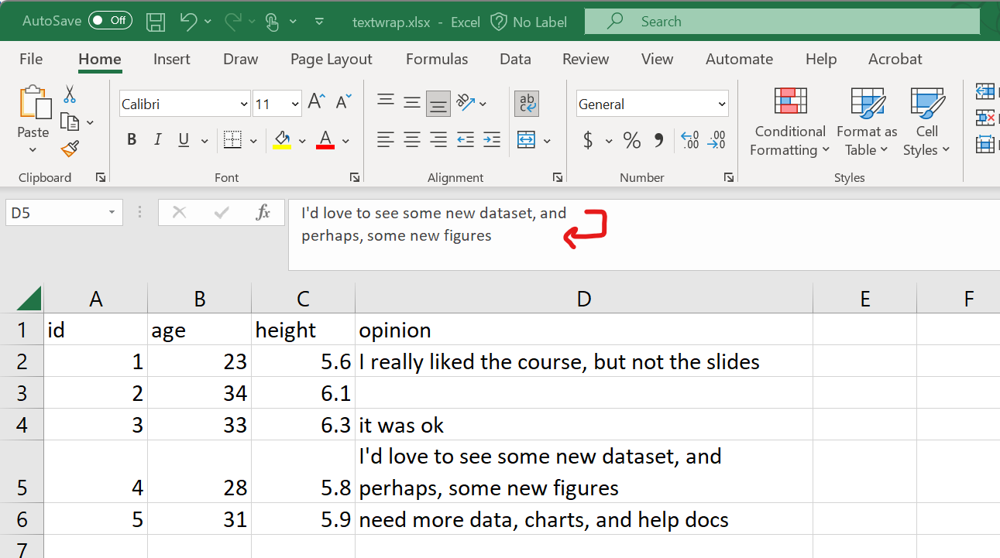
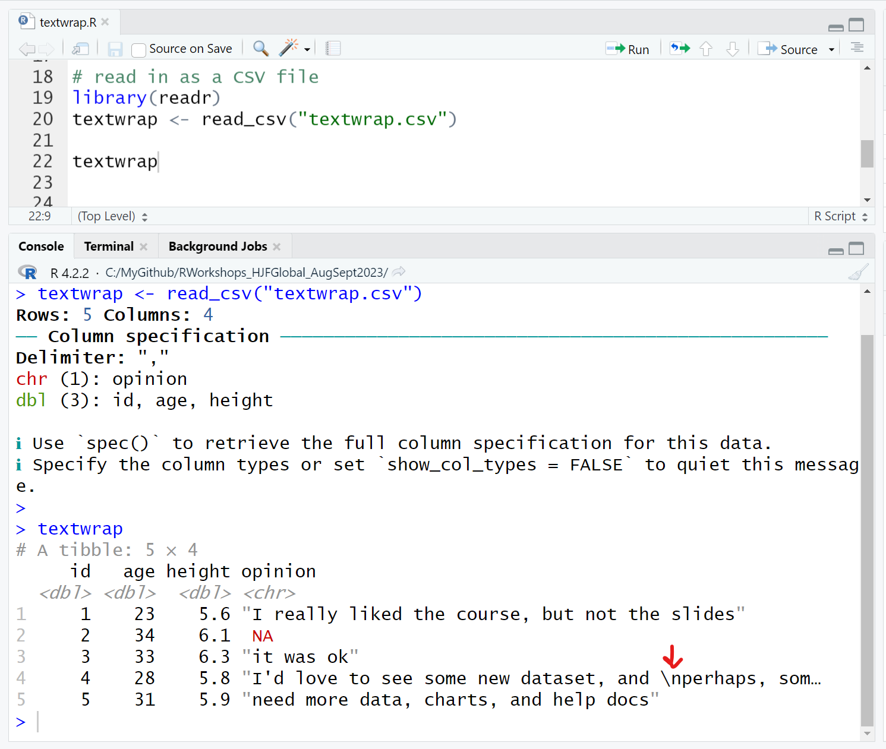
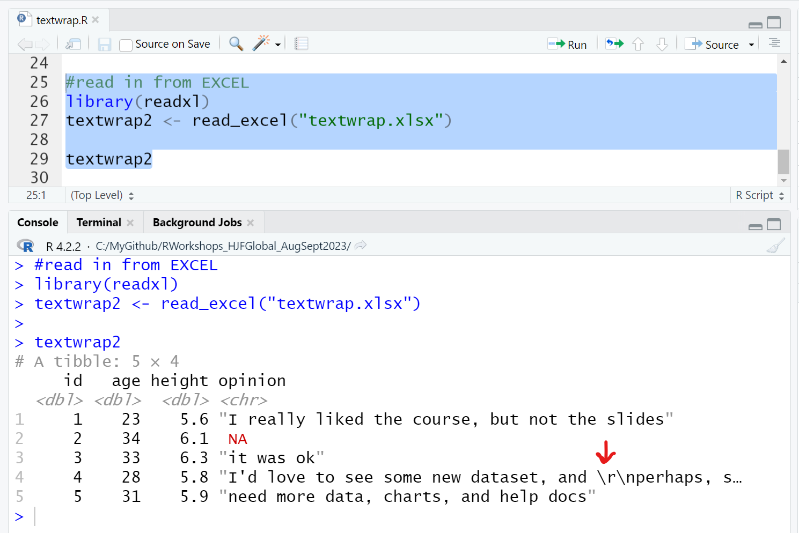

```{r setup, include=FALSE}
# set up knitr options
knitr::opts_chunk$set(echo = TRUE,
                      error = TRUE,
                      warning = FALSE,
                      message = FALSE)
```

Here is an example on reading a data file that contains a column with text blocks from a file that has commas in the comment/text block and possibly also has carriage returns in a long text block.

The example data file has a column called `opinion`. For subject ID 4, their `opinion` comment includes not only some commas but also has a carriage (line) return about halfway.

Here is a screenshot of this from EXCEL - see the text block for ID 4 - notice that there are 2 lines for this subject's text block - that is because there is a carriage return after "and".



Download these 2 "textwrap" datasets:

* [textwrap.csv](https://melindahiggins2000.github.io/RWorkshops_HJFGlobal_AugSept2023/textwrap.csv)
* [textwrap.xlsx](https://melindahiggins2000.github.io/RWorkshops_HJFGlobal_AugSept2023/textwrap.xlsx)

## Read in the CSV file

For the CSV formatted file, you can read in the datafile using the `readr` package with `readr::read_csv()` function.

```{r}
# read in as a CSV file
library(readr)
textwrap <- read_csv("textwrap.csv")

textwrap
```

You'll notice that the `opinion` block of text has `\n` which indicates that there is a carriage return (new line) right before the word `perhaps`.




## Read in the EXCEL formatted file

For the XLSX (EXCEL) formatted file, you can read in the datafile using the `readxl` package with `readr::read_excel()` function.

```{r}
#read in from EXCEL
library(readxl)
textwrap2 <- read_excel("textwrap.xlsx") 

textwrap2
```

You'll notice that the `opinion` block of text has `\r\n` which indicates that there is a carriage return (new line) right before the word `perhaps`.



So, there are some slight differences in the final output for how the carriage return characters are captured, but both approaches work.


